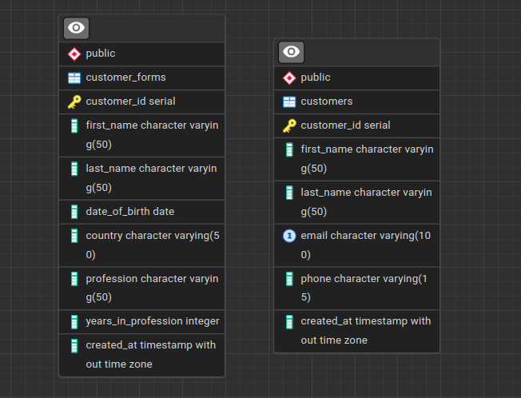

# Customer Form Development Project

The project is seperated into two parts - Backend and Frontend 

#### First, clone the repository locally


### To get Back-end running

First, you should set up your PostgreSQL database for the back-end to work properly

Here is the schema for the datbase



Next, create a .env file in the Backend folder and put your Postgre connection credentials there

```
POSTGRE_HOST=
POSTGRE_PORT=
POSTGRE_USERNAME=
POSTGRE_PASSWORD=
POSTGRE_DATABASE=
```

All done! Now

```bash
cd Backend
npm install
node server.js
```

The server will be running on http://localhost:3000, where the front-end is making api calls (hardcoded)

### To get Front-end running

```bash
cd Frontend
npm install
npm run dev
```

A Vite server starts with the local address to visit the application
